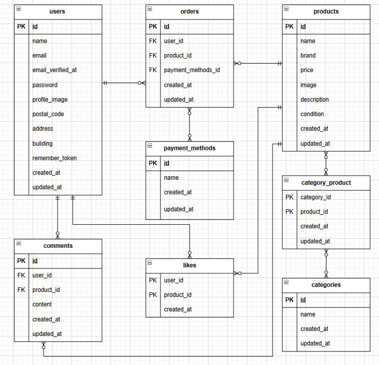

# flea-market-app

## 環境構築
**Dockerビルド**
1.
``` bash
git clone git@github.com:kozu-ike/flea-market-app.git
```

2. DockerDesktopアプリを立ち上げる
``` bash
docker-compose up -d --build
```

**Laravel環境構築**
3. `docker-compose exec php bash`
4. `composer install`
5. 「.env.example」ファイルを 「.env」ファイルに命名を変更。
    または、新しく.envファイルを作成
``` bash
cp .env.example .env
```
6. .envに以下の環境変数を追加
```bash
DB_CONNECTION=mysql
DB_HOST=mysql
DB_PORT=3306
DB_DATABASE=laravel_db
DB_USERNAME=laravel_user
DB_PASSWORD=laravel_pass

STRIPE_SECRET=your_stripe_secret_key   # あなたのStripeのAPIキー
```

- コマンドを実行してキャッシュをクリアし、設定が反映されるようにする。
``` bash
php artisan config:cache
```

7. アプリケーションキーの作成
``` bash
php artisan key:generate
```

8. マイグレーションの実行
``` bash
php artisan migrate
```

9. シーディングの実行
``` bash
php artisan db:seed
```

## 画像ファイルの取り扱い
プロジェクトに画像ファイルが必要な場合は、リポジトリに含まれる `product.zip` を解凍し、`storage/app/public/products` フォルダに配置してください。

1. `product.zip` を解凍
2. 解凍した画像を `storage/app/public/products` フォルダに配置

## シンボリックリンクの作成
画像やファイルを正しく保存・表示するために、以下のコマンドを実行してシンボリックリンクを作成してください：

```bash
php artisan storage:link
```

## メール認証について

- ユーザー登録後、メールアドレスの確認が必須です。
- メール認証が完了していない場合、ログインや一部機能が制限されます。（例：マイページ遷移など）。

- 認証メール内のリンクは発行から60分間のみ有効です。

## メール送信の確認方法（開発環境）
Mailtrap（開発用メールボックス）
開発環境でのメール送信確認には Mailtrap を使用しています。

- 実際のメール送信は行われず、安全に検証できます。

- Mailtrap の UI 上で送信されたメールを確認可能です。

- Mailtrap の設定方法
.env ファイルに以下を追記・修正してください：

```bash
MAIL_MAILER=smtp
MAIL_HOST=smtp.mailtrap.io
MAIL_PORT=2525
MAIL_USERNAME=your_mailtrap_username   # あなたの Mailtrap アカウントのユーザー名
MAIL_PASSWORD=your_mailtrap_password   # あなたの Mailtrap アカウントのパスワード
MAIL_ENCRYPTION=null
MAIL_FROM_ADDRESS=no-reply@example.com  # メール送信元アドレス
MAIL_FROM_NAME="Flea Market App"

```
- MAIL_USERNAME と MAIL_PASSWORD は Mailtrap ダッシュボード の SMTP Settings に記載されています。使用する inbox に合わせてコピーしてください。
メール送信エラーは `storage/logs/laravel.log` に記録されます。

## 使用ツール

### Mailtrap（オプション）

- Mailtrap を使う場合は .env に自分のAPI情報を入力してください。
- Mailtrap 管理画面: https://mailtrap.io


## 使用技術(実行環境)
- PHP 8.2.27
- Laravel 8.83.29
- MariaDB 10.11.6

## 外部サービス
- Stripe：クレジットカード決済機能
- Mailtrap：開発・テスト用のメール送信確認

## ER図


## URL
- 開発環境：http://localhost/
- phpMyAdmin:http://localhost:8080/

## テスト環境設定

本プロジェクトでは、テスト環境をセットアップするためにいくつかの設定が必要です。詳細については [テスト環境設定ガイド](docs/test-setup.md) をご覧ください。
